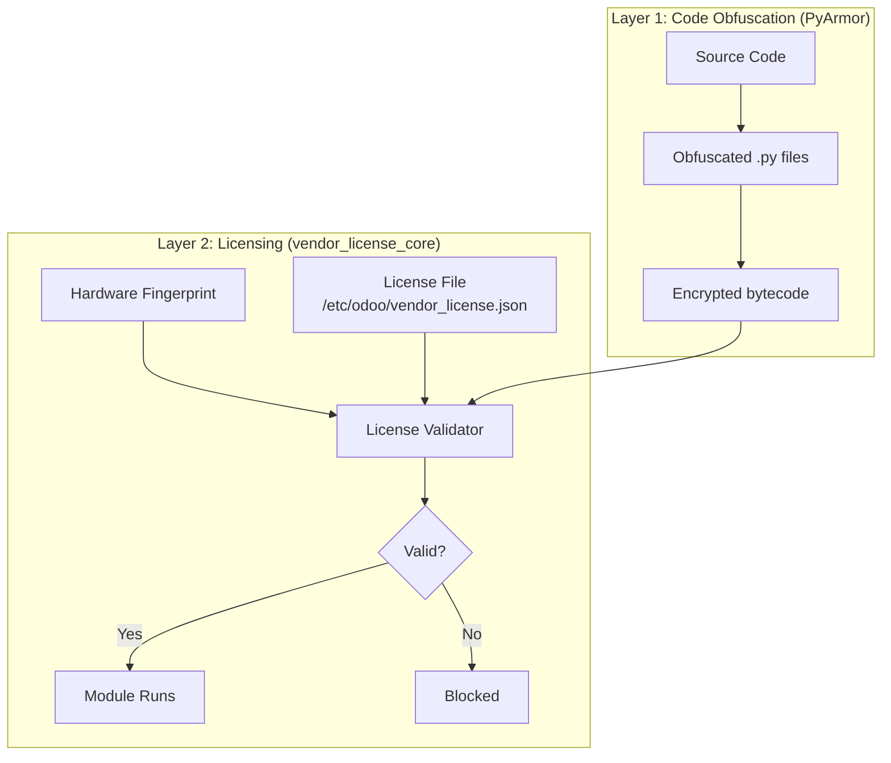
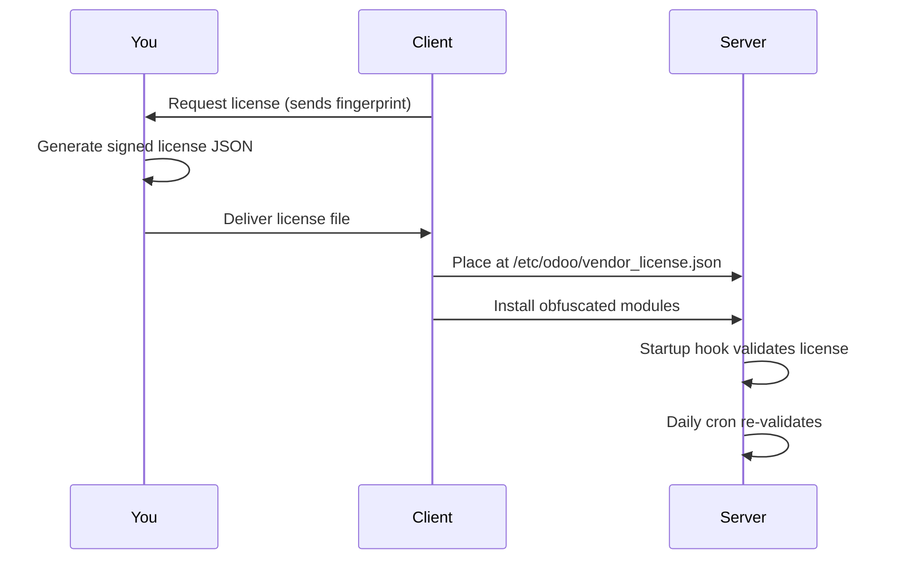

# Code Protection Strategy - Final Design

## Configuration Decisions

| Setting | Decision |
|---------|----------|
| **Protection Layers** | PyArmor obfuscation + vendor_license_core |
| **License Server** | Client premises (offline) |
| **Offline Support** | Yes, full offline operation |
| **Employee Count Limit** | Yes, enforced in license |
| **Module-Specific Licensing** | No, single license covers all modules |

---

## Architecture



---

## Module Structure

```
vendor_license_core/
├── __init__.py
├── __manifest__.py
├── security/
│   └── ir.model.access.csv
├── models/
│   ├── __init__.py
│   └── license_state.py
├── services/
│   ├── __init__.py
│   ├── fingerprint.py          # MAC + machine-id + CPU
│   ├── validator.py            # License + employee count check
│   └── crypto.py               # RSA signature verification
├── hooks/
│   ├── __init__.py
│   └── startup.py              # Post-init validation
├── data/
│   └── cron.xml                # Daily re-validation
└── views/
    └── license_view.xml        # Admin status view
```

---

## License File Format

`/etc/odoo/vendor_license.json`:

```json
{
    "license_id": "LIC-2026-0001",
    "customer": "THACO Corporation",
    "fingerprint_hash": "abc123def456...",
    "expiry": "2027-02-07",
    "max_employees": 500,
    "signature": "base64-RSA-signature..."
}
```

> [!NOTE]
> Single license covers all payroll modules (Vietnam, Indonesia, etc.)

---

## Enforcement Points

License validated at these critical business operations:

| Module | Enforcement Point |
|--------|------------------|
| `om_hr_payroll` | `hr.payslip.action_payslip_done()` |
| `om_hr_payroll` | `hr.payslip.compute_sheet()` |
| `payroll_analytics_approval` | Bank file export wizard |
| `pb_hr_payroll_vietnam` | PIT/SI XML generation |
| `pb_hr_govt` | Government report generation |

Employee count validated against `max_employees` in license.

---

## Deployment Workflow



---

## Security Summary

| Attack | Protection |
|--------|-----------|
| Copy database to new server | Fingerprint mismatch blocks |
| Read/copy source code | PyArmor obfuscation |
| Forge license file | RSA signature invalid |
| Remove cron job | Startup hook still validates |
| Add more employees than licensed | Employee count check fails |
| Offline operation | Fully supported |

---

## Implementation Phases

### Phase 1: Core Module
- [ ] Create `vendor_license_core` module
- [ ] Hardware fingerprinting (MAC + machine-id + CPU)
- [ ] RSA crypto with signature verification
- [ ] License validator with employee count check
- [ ] Startup hook + daily cron

### Phase 2: License Generator
- [ ] Generate RSA keypair
- [ ] License generation script (your side only)

### Phase 3: Integration
- [ ] Add enforcement to payroll modules
- [ ] Add enforcement to export wizards
- [ ] Add enforcement to government reports

### Phase 4: Obfuscation
- [ ] PyArmor setup and configuration
- [ ] Obfuscation script for deployment builds

### Phase 5: Documentation
- [ ] Client deployment guide
- [ ] License activation process
