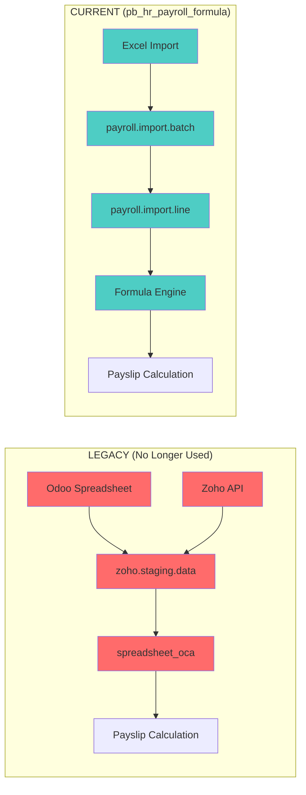
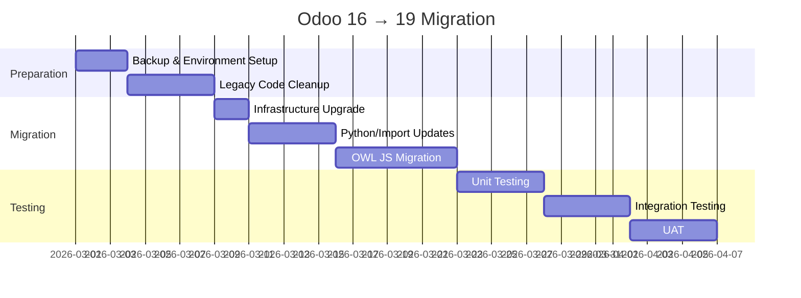

# Legacy Code Cleanup & Odoo 19 Migration Analysis

## Executive Summary

This document analyzes:
1. **Legacy Code Cleanup**: Spreadsheet/Zoho staging code no longer needed since switching to `pb_hr_payroll_formula`
2. **Odoo 19 Migration**: Breaking changes and effort required to migrate from Odoo 16 CE

---

# Part 1: Legacy Code Cleanup

## Current Architecture



---

## Legacy Models Identified

### 🔴 In `om_hr_payroll/models/`

| Model | File | Description | Status |
|-------|------|-------------|--------|
| `zoho.employee.data` | `hr_zoho.py` | Raw Zoho employee data storage | ⚠️ Review |
| `zoho.timesheet.importer` | `hr_zoho.py` | Zoho timesheet import wizard | ⚠️ Review |
| `zoho.staging.data` | `hr_zoho_staging.py` | Staging data from Zoho | **REMOVE** |
| `zoho.staging.importer` | `hr_zoho_staging.py` | Staging import wizard | **REMOVE** |

### 🔴 Legacy Backup Files (Definite Removal)

```
om_hr_payroll/models/hr_zoho_stagingpy25Apr    (31KB)
om_hr_payroll/models/hr_zohoorig27Feb          (50KB)
om_hr_payroll/models/hr_zohopy25Apr            (50KB)
```

---

## Spreadsheet Module Dependencies

### 🔴 Modules referencing `spreadsheet_oca`

| Module | Dependency Location | Action |
|--------|---------------------|--------|
| `pb_hr_payroll_vietnam` | `__manifest__.py`, views, data | Remove refs |
| `pb_hr_payroll_singapore` | `__manifest__.py`, views | Remove refs |
| `pb_hr_payroll_malaysia` | `__manifest__.py`, views | Remove refs |
| `pb_hr_payroll_indonesia` | `__manifest__.py`, views | Remove refs |
| `pb_hr_payroll_thailand` | `__manifest__.py`, views | Remove refs |
| `pb_hr_payroll_cambodia` | `__manifest__.py`, views | Remove refs |
| `pb_hr_payroll_india` | `__manifest__.py`, views | Remove refs |

### 🔴 Entire Modules to Consider Removing

| Module | Size | Reason |
|--------|------|--------|
| `spreadsheet_oca` | 84 files | No longer primary calculation engine |
| `spreadsheet` | 170 files | Odoo Enterprise spreadsheet (not used) |
| `spreadsheet_dashboard_oca` | 26 files | Dashboard for unused spreadsheets |

---

## Files to Remove (By Module)

### `om_hr_payroll`

```
models/hr_zoho_stagingpy25Apr     # Backup file
models/hr_zohoorig27Feb           # Backup file  
models/hr_zohopy25Apr             # Backup file
```

### `pb_hr_payroll_vietnam`

```
data/spreadsheet_data.xml         # Vietnam spreadsheet template
views/vietnam_server_actions.xml  # Lines 4-33 (spreadsheet actions)
```

### `pb_hr_payroll_base`

```
views/zoho_staging_views.xml      # Enhanced staging views (if not used)
views/zoho_menu_integration.xml   # Staging batch processing
```

### All Country Modules (Pattern)

Dashboard buttons and actions referencing:
- `action_*_edit_spreadsheet`
- `action_*_import_spreadsheet`
- `action_zoho_staging_importer_*`

---

## Safe to Remove ✅

These items can be safely removed without affecting `pb_hr_payroll_formula`:

1. **Backup files** in `om_hr_payroll/models/`
2. **Spreadsheet data files** (`spreadsheet_data.xml`)
3. **Spreadsheet server actions** in views
4. **Dashboard spreadsheet buttons** in country modules
5. **`spreadsheet_oca` dependency** from country module manifests

---

## Review Required ⚠️

These may still be in use or have hidden dependencies:

| Item | Concern |
|------|---------|
| `zoho.employee.data` | May be used for employee sync outside payroll |
| `zoho.timesheet.importer` | May be used for attendance import |
| `pb_hr_payroll_formula/integrations/zoho_connector.py` | Alternative Zoho connector - KEEP |

> [!IMPORTANT]
> **Before removing**: Search codebase for any active usage of `zoho.staging.data` and `zoho.employee.data` models outside the legacy spreadsheet flow.

---

## Recommended Cleanup Approach

### Phase 1: Safe Deletions
1. Remove backup files (`*py25Apr`, `*orig27Feb`)
2. Remove `spreadsheet_data.xml` from all country modules
3. Remove `spreadsheet_oca` from manifest dependencies

### Phase 2: View Cleanup
1. Remove spreadsheet buttons from dashboards
2. Remove spreadsheet server actions
3. Remove Zoho staging menu items

### Phase 3: Model Cleanup (After Validation)
1. Remove `zoho.staging.data` model and views
2. Remove `zoho.staging.importer` wizard
3. Keep `zoho.employee.data` if used elsewhere

### Phase 4: Module Removal (Optional)
1. Archive `spreadsheet_oca` module
2. Archive `spreadsheet` module
3. Archive `spreadsheet_dashboard_oca` module

---

# Part 2: Odoo 16 → 19 Migration

## Infrastructure Requirements

| Requirement | Odoo 16 | Odoo 19 | Action |
|------------|---------|---------|--------|
| Python | 3.8+ | **3.12+** | Upgrade server |
| PostgreSQL | 12+ | **16** | Upgrade database |
| Ubuntu | 20.04 | **24.04 LTS** | Upgrade OS |

> [!CAUTION]
> Python 3.12 is mandatory. Many libraries may need updates or replacements.

---

## Breaking Python Changes

### 1. Import Statement Changes

```diff
# Registry import
- from odoo import registry
+ from odoo.modules.registry import Registry

# xlsxwriter import
- from odoo.tools.misc import xlsxwriter
+ import xlsxwriter

# HTTP route type
- @http.route(..., type='json')
+ @http.route(..., type='jsonrpc')
```

### 2. Model Definition Changes

```diff
# _inherit must be list format in Odoo 19
- _inherit = 'hr.payslip'
+ _inherit = ['hr.payslip']

# _name becomes optional with _inherit
```

### 3. Removed Models

| Removed | Alternative |
|---------|-------------|
| `res.partner.title` | Migrate data to custom field |
| `stock.valuation.layer` | Use `stock.move` valuation |

---

## OWL Framework Migration

### Impact on Your Modules

> [!WARNING]
> **High Impact**: Custom JavaScript must be rewritten in OWL.

| Module | JS Assets | OWL Migration Needed |
|--------|-----------|---------------------|
| `pb_hr_payroll_formula` | `multisheet_enhancements.js` | **Yes** |
| `pb_hr_payroll_formula` | Excel grid widgets (commented) | If enabled |
| `payroll_analytics_approval` | Dashboard JS | **Review** |

### OWL Refactoring Effort

Currently disabled JS (lower priority):
```
# pb_hr_payroll_formula/static/src/js/
excel_grid_widget.js      # Commented out
formula_bar.js            # Commented out
column_header.js          # Commented out
cell_editor.js            # Commented out
formula_autocomplete.js   # Commented out
grid_actions.js           # Commented out
```

Active JS (must migrate):
```
multisheet_enhancements.js  # Must convert to OWL
```

---

## Module Compatibility Checklist

### Your Custom Modules

| Module | Python OK? | Views OK? | JS Migration? | Effort |
|--------|------------|-----------|---------------|--------|
| `pb_hr_payroll_formula` | ⚠️ Update imports | ✅ | Medium | **High** |
| `pb_hr_payroll_base` | ⚠️ Update imports | ✅ | Low | **Medium** |
| `pb_hr_payroll_vietnam` | ⚠️ Update imports | ✅ | None | **Low** |
| `payroll_analytics_approval` | ⚠️ Update imports | ✅ | Low | **Medium** |
| `om_hr_payroll` | ⚠️ Major updates | ⚠️ | Low | **High** |

### Third-Party/OCA Modules

| Module | Odoo 19 Port Status | Action |
|--------|---------------------|--------|
| `spreadsheet_oca` | Unknown | Check OCA repos |
| `report_xlsx` | Likely available | Verify |
| `hr_holidays_public` | Likely available | Verify |

---

## New Odoo 19 Features to Leverage

| Feature | Benefit for Payroll |
|---------|---------------------|
| AI-powered analytics | Payroll forecasting |
| Improved HR module | Better employee management |
| Performance improvements | Faster batch processing |
| New ORM operators (`any!`, `not any!`) | Cleaner queries |

---

## Migration Timeline Estimate



**Estimated Total: 4-5 weeks**

---

## Recommendations

### Before Migration

1. ✅ Complete legacy code cleanup (reduces migration scope)
2. ✅ Remove unused spreadsheet modules
3. ✅ Audit all custom JavaScript

### During Migration

1. Start with `pb_hr_payroll_formula` (core module)
2. Migrate country modules in parallel
3. Test each module independently before integration

### Risk Mitigation

1. Set up staging Odoo 19 environment first
2. Run parallel systems during testing
3. Plan for 2-3 week buffer for unexpected issues

---

## Decision Points for You

1. **Remove `spreadsheet_oca` entirely?** Or keep for potential future use?
2. **Remove Zoho staging models?** Or keep for non-payroll employee sync?
3. **Timeline**: When do you want to target Odoo 19 migration?
4. **OWL expertise**: Do you have resources for JavaScript rewrite?
