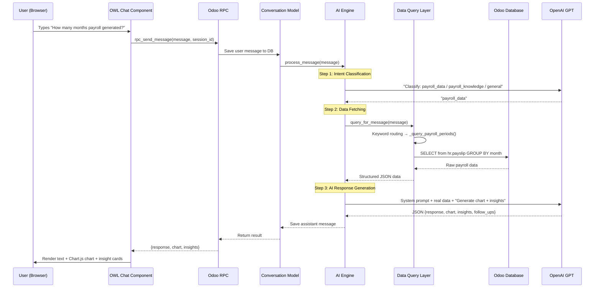

# PayAI — Architecture & Flow Walkthrough

## How It Works — End-to-End Flow



## The 5-Layer Architecture

```
┌─────────────────────────────────────────────┐
│  Layer 1: FRONTEND (OWL Components)         │
│  ai_insight_chat.js → floating pill + chat  │
│  ai_dashboard.js    → widget grid           │
│  chart_renderer.js  → Chart.js rendering    │
├─────────────────────────────────────────────┤
│  Layer 2: CONVERSATION (Odoo Models)        │
│  payroll_ai_conversation.py                 │
│  → Session management, message history      │
│  → RPC endpoints for frontend               │
├─────────────────────────────────────────────┤
│  Layer 3: AI ENGINE (Brain)                 │
│  payroll_ai_engine.py                       │
│  → Intent classification                    │
│  → Routes to data vs knowledge vs general   │
│  → Assembles prompts with real data         │
├─────────────────────────────────────────────┤
│  Layer 4: DATA QUERY (ORM Layer)            │  ← YOU DEFINE QUERIES HERE
│  payroll_data_query.py                      │
│  → Keyword routing                          │
│  → ORM queries against Odoo models          │
│  → Returns structured JSON                  │
├─────────────────────────────────────────────┤
│  Layer 5: AI PROVIDER (External API)        │
│  openai_provider.py                         │
│  → Sends prompts to OpenAI                  │
│  → Receives structured JSON responses       │
└─────────────────────────────────────────────┘
```

## How Intent Classification Works

The engine sends the user's message to GPT with a simple prompt:

```
Classify this message into:
1. "payroll_data"      → needs database query (salary, headcount, costs...)
2. "payroll_knowledge"  → conceptual HR question (what is CTC, tax rules...)
3. "general"           → anything else (draft email, explain concept...)
```

GPT responds with **one word**. Then:

| Intent | What Happens | Data Source |
|--------|-------------|-------------|
| `payroll_data` | Queries DB → feeds data to GPT → gets chart + narrative | Real Odoo data |
| `payroll_knowledge` | Sends directly to GPT | GPT's training data |
| `general` | Sends directly to GPT | GPT's training data |

> [!IMPORTANT]
> Only `payroll_data` queries the database. Knowledge and general questions go straight to GPT without any data lookup.

## The Data Query Layer — Where You Define Queries

This is the key file: [payroll_data_query.py](file:///Users/adity/Documents/GitHub/gitlocal/pb_payroll_ai_insights/models/payroll_data_query.py)

### How Keyword Routing Works

```python
def query_for_message(self, message, context=None):
    msg_lower = message.lower()
    
    # More specific routes FIRST, generic routes LAST
    if any(kw in msg_lower for kw in ['how many month', 'payroll generated']):
        return self._query_payroll_periods(msg_lower, context)
    elif any(kw in msg_lower for kw in ['salary', 'wage', 'compensation']):
        return self._query_salary_data(msg_lower, context)
    elif any(kw in msg_lower for kw in ['headcount', 'employee count']):
        return self._query_headcount_data(msg_lower, context)
    # ... more routes ...
    else:
        return self._query_general_summary(context)  # fallback
```

> [!TIP]
> **Order matters!** Put specific keywords before generic ones. `'payroll generated'` must come before `'pay'` otherwise "payroll" matches the salary route.

### Current Query Types

| Query Type | Keywords | Models Queried |
|-----------|----------|---------------|
| `payroll_periods` | months, generated, payslip, batch | `hr.payslip` |
| `salary` | salary, wage, compensation, ctc | `hr.contract` |
| `headcount` | headcount, employee count, staff | `hr.employee` |
| `overtime` | overtime, OT, extra hours | `hr.payslip.line` |
| `deductions` | deduction, tax, insurance | `hr.payslip.line` |
| `payroll_cost` | cost, expense, budget | `hr.payslip` + lines |
| `trend` | trend, monthly, history, growth | `hr.payslip` |
| `department` | department, team, division | `hr.employee` + `hr.contract` |
| `individual` | individual, person, name | `hr.employee` + `hr.contract` |

## How to Add a New Query (e.g., Leave/Attendance Data)

### Step 1: Add Keywords to Router

In `query_for_message()`, add a new route **before** the generic fallback:

```python
elif any(kw in msg_lower for kw in ['leave', 'absence', 'time off', 'vacation',
                                     'sick leave', 'annual leave']):
    return self._query_leave_data(msg_lower, context)
```

### Step 2: Write the Query Method

```python
def _query_leave_data(self, message, context):
    """Query leave/absence data."""
    Leave = self.env['hr.leave'].sudo()
    
    # Query Odoo ORM
    leaves = Leave.search([
        ('state', '=', 'validate'),
        ('date_from', '>=', fields.Date.today().replace(month=1, day=1)),
    ])
    
    # Group by leave type
    type_data = {}
    for leave in leaves:
        lt = leave.holiday_status_id.name or 'Other'
        if lt not in type_data:
            type_data[lt] = {'count': 0, 'days': 0}
        type_data[lt]['count'] += 1
        type_data[lt]['days'] += leave.number_of_days
    
    result = [
        {'leave_type': lt, 'count': d['count'], 'total_days': d['days']}
        for lt, d in sorted(type_data.items(), key=lambda x: x[1]['days'], reverse=True)
    ]
    
    # Return structured data — AI will generate the chart from this
    return {
        'query_type': 'leave_by_type',
        'title': 'Leave Statistics (This Year)',
        'data': result,
        'total_leaves': sum(d['count'] for d in result),
        'total_days': sum(d['total_days'] for d in result),
        'suggested_chart': 'doughnut',  # hint for the AI
    }
```

### Step 3: That's It!

No other changes needed. The AI engine automatically:
1. ✅ Classifies the intent as `payroll_data`
2. ✅ Calls your new query method
3. ✅ Feeds the structured data into GPT with the system prompt
4. ✅ GPT generates a Chart.js config + narrative + insights
5. ✅ Frontend renders the chart

> [!NOTE]
> **You don't write chart code.** You just return structured JSON data. The AI decides the best chart type, colors, labels, and generates the full Chart.js config. The `suggested_chart` field is a hint but GPT may override it.

## How to Include Other Models

Any Odoo model is accessible. Just use `self.env['model.name'].sudo()`:

```python
# Examples of models you could query:
self.env['hr.leave']            # Leaves/time off
self.env['hr.attendance']       # Attendance records  
self.env['hr.expense']          # Employee expenses
self.env['account.move']        # Invoices/journal entries
self.env['sale.order']          # Sales orders
self.env['project.task']        # Project tasks
self.env['hr.recruitment']      # Recruitment/applicants
```

> [!WARNING]
> Always use `.sudo()` since the AI engine runs as the logged-in user. Without sudo, data access depends on record rules which may hide data the AI needs for analytics.

## Module Dependencies

If you query models from other modules, add them to `__manifest__.py`:

```python
'depends': [
    'om_hr_payroll',        # payslips, salary rules
    'pb_hr_payroll_base',   # base payroll
    'hr',                   # employees, departments
    'hr_contract',          # contracts
    'hr_holidays',          # ADD THIS if querying leaves
    'hr_attendance',        # ADD THIS if querying attendance
],
```

## The "JSON-First" Pattern

The key design decision: **the AI returns JSON, not HTML**.

```
User asks "Show salary distribution"
    ↓
Data Query returns: {departments: [...], salaries: [...]}
    ↓
AI generates: {
    "response": "Here's the salary breakdown...",
    "chart": {                          ← Chart.js v4 config
        "type": "bar",
        "data": {"labels": [...], "datasets": [...]},
        "options": {"plugins": {"title": {"text": "..."}}}
    },
    "insights": ["Dept X has highest avg salary..."],
    "follow_up_questions": ["Compare by job level?"]
}
    ↓
Frontend ChartRenderer creates <canvas> and renders with Chart.js
```

This means:
- Charts are **interactive** (hover, tooltips)
- Charts are **responsive** (resize with container)
- No image generation needed
- The AI controls visualization through structured data

## Key Files Reference

| File | Purpose |
|------|---------|
| [payroll_ai_engine.py](file:///Users/adity/Documents/GitHub/gitlocal/pb_payroll_ai_insights/models/payroll_ai_engine.py) | Brain — intent classification + response assembly |
| [payroll_data_query.py](file:///Users/adity/Documents/GitHub/gitlocal/pb_payroll_ai_insights/models/payroll_data_query.py) | Data layer — ORM queries, keyword routing |
| [openai_provider.py](file:///Users/adity/Documents/GitHub/gitlocal/pb_payroll_ai_insights/ai_providers/openai_provider.py) | OpenAI API client |
| [payroll_ai_conversation.py](file:///Users/adity/Documents/GitHub/gitlocal/pb_payroll_ai_insights/models/payroll_ai_conversation.py) | Chat sessions + RPC endpoints |
| [payroll_ai_dashboard.py](file:///Users/adity/Documents/GitHub/gitlocal/pb_payroll_ai_insights/models/payroll_ai_dashboard.py) | Dashboard + widget grid |
| [ai_insight_chat.js](file:///Users/adity/Documents/GitHub/gitlocal/pb_payroll_ai_insights/static/src/components/ai_insight_chat/ai_insight_chat.js) | Floating chat pill (OWL) |
| [chart_renderer.js](file:///Users/adity/Documents/GitHub/gitlocal/pb_payroll_ai_insights/static/src/components/chart_renderer/chart_renderer.js) | Chart.js rendering component |
