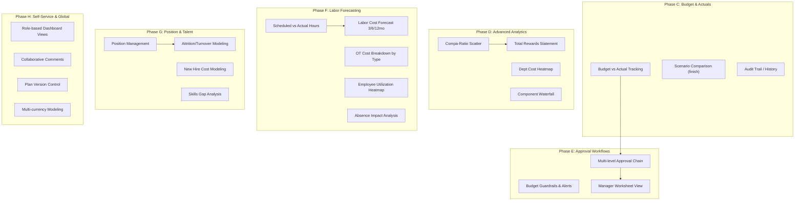

# Workday Complete Feature Implementation Plan

## Architecture Overview

We already have **Phase A** (Compensation Dashboard) and **Phase B** (Labor Analytics) deployed. This plan covers **Phases C through H** to close all Workday gaps.



---

## User Review Required

> [!IMPORTANT]
> **Phasing**: This is 6 phases of work. I recommend deploying each phase independently so you can test before moving to the next. Should I build all 6 sequentially, or do you want to prioritize specific phases?

> [!WARNING]
> **Position Management (Phase G)** is the most architectural change — it adds a new `wfp.position` model that becomes the backbone of headcount planning. This changes how scenarios work. Should we build it, or is it lower priority?

> [!IMPORTANT]
> **Skills Gap Analysis** requires a skills framework (`hr.skill` in Odoo 19). Is the skills module installed on Payobook19?

---

## Phase C: Budget vs. Actual Tracking & Scenario Comparison

**Goal**: Close the planning loop — track what was actually spent against what was forecasted.

### Component C1: Budget vs. Actual Model

#### [NEW] budget_tracking.py
New model `wfp.budget.actual` that captures actual spend snapshots:

```python
class WfpBudgetActual(models.Model):
    _name = 'wfp.budget.actual'
    _description = 'Budget vs Actual Tracking'
    
    scenario_id = fields.Many2one('wfp.planning.scenario')
    period_start = fields.Date()
    period_end = fields.Date()
    period_type = fields.Selection([
        ('monthly', 'Monthly'), ('quarterly', 'Quarterly'), ('annual', 'Annual')
    ])
    
    # Forecasted (from scenario)
    forecast_headcount = fields.Integer()
    forecast_cost = fields.Monetary()
    
    # Actual (from payroll)
    actual_headcount = fields.Integer()
    actual_cost = fields.Monetary()
    
    # Delta
    variance_amount = fields.Monetary(compute='_compute_variance')
    variance_pct = fields.Float(compute='_compute_variance')
    
    # Department breakdown
    department_id = fields.Many2one('hr.department')
```

**API**: `get_budget_vs_actual_data(scenario_id)` — pulls actual payroll costs from `hr.payslip` aggregated by month, compares against scenario forecast projections.

**Data source**: Uses existing `wfp.monthly.projection` for forecast side, `hr.payslip.line` for actual side.

#### [MODIFY] planning_scenario.py
- Add `actual_total_cost` computed field (sum from payslips for same period)
- Add `budget_utilization_pct` computed field
- Add `get_budget_vs_actual_data()` API method
- Add `capture_actuals()` action to snapshot current payroll data

### Component C2: Scenario Comparison (Finish)

#### [MODIFY] planning_scenario.py
- Enhance existing `get_comparison_data()` to include:
  - Per-department delta analysis
  - Per-component waterfall data (which components differ most)
  - Headcount delta

#### [MODIFY] workforce_planning_dashboard.js
- Wire up the existing comparison dropdown to call `get_comparison_data()`
- Render side-by-side bar chart overlay (already have the UI placeholder)

### Component C3: Audit Trail

#### [MODIFY] planning_scenario.py
- Add `approval_ids` One2many to track approvals
- Add `get_audit_trail()` method returning sorted history

#### [NEW] scenario_approval.py
```python
class WfpScenarioApproval(models.Model):
    _name = 'wfp.scenario.approval'
    _description = 'Scenario Approval Log'
    
    scenario_id = fields.Many2one('wfp.planning.scenario')
    action = fields.Selection([
        ('created', 'Created'), ('calculated', 'Calculated'),
        ('submitted', 'Submitted for Approval'),
        ('approved', 'Approved'), ('rejected', 'Rejected'),
        ('comment', 'Comment Added'),
    ])
    user_id = fields.Many2one('res.users')
    timestamp = fields.Datetime(default=fields.Datetime.now)
    comment = fields.Text()
    snapshot_data = fields.Json()  # JSON snapshot of key metrics at time of action
```

### Files Changed (Phase C)
| File | Action | Purpose |
|------|--------|---------|
| `models/budget_tracking.py` | NEW | Budget vs. Actual model |
| `models/scenario_approval.py` | NEW | Audit trail model |
| `models/planning_scenario.py` | MODIFY | Add budget APIs, audit integration |
| `models/__init__.py` | MODIFY | Register new models |
| `views/budget_tracking_views.xml` | NEW | Budget tracking views |
| `security/ir.model.access.csv` | MODIFY | Add access for new models |
| `static/src/js/workforce_planning_dashboard.js` | MODIFY | Scenario comparison chart, budget tab |
| `static/src/xml/workforce_planning_templates.xml` | MODIFY | Budget vs. Actual section, comparison overlay |

---

## Phase D: Advanced Analytics & Visualizations

**Goal**: Add the Workday-grade analytics visualizations and Total Rewards.

### Component D1: Compa-Ratio Scatter Plot

#### [MODIFY] planning_scenario.py
- Add `get_compa_ratio_data()` method:
  - For each employee forecast: `{ name, department, performance_rating, compa_ratio, current_salary }`
  - Compa-ratio = `current_base / pay_grade.midpoint` (from existing `wfp.pay.grade`)
  - Performance from `hr.employee.performance_rating` or `hr.appraisal`

#### [MODIFY] workforce_planning_dashboard.js
- Add scatter plot using Chart.js: X=Compa-ratio, Y=Performance, bubble size=salary, color=department

### Component D2: Department Cost Heatmap

#### [MODIFY] planning_scenario.py
- Add `get_dept_cost_heatmap()` method:
  - Returns matrix: `{ departments: [...], metrics: ['headcount', 'avg_increase_pct', 'total_cost', 'budget_util'], data: [[...]] }`

#### [MODIFY] workforce_planning_dashboard.js
- Render HTML table with CSS gradient backgrounds based on intensity values
- No Chart.js needed — pure CSS heatmap for crisp rendering

### Component D3: Component Waterfall Chart

#### [MODIFY] planning_scenario.py
- Add `get_component_waterfall()` method:
  - Groups all forecast components by `wfp_category`
  - Returns: `{ components: [{name, current, forecast, delta}], total_delta }`

#### [MODIFY] workforce_planning_dashboard.js
- Render waterfall chart (stacked bar with connecting lines) using Chart.js

### Component D4: Total Rewards Statement

#### [NEW] total_rewards.py
```python
class WfpTotalRewards(models.TransientModel):
    _name = 'wfp.total.rewards'
    _description = 'Total Rewards Statement'
    
    employee_id = fields.Many2one('hr.employee')
    
    # Compensation
    base_salary = fields.Monetary()
    allowances = fields.Monetary()
    bonus = fields.Monetary()
    
    # Benefits
    insurance_value = fields.Monetary()
    pension_value = fields.Monetary()
    leave_value = fields.Monetary()
    
    # Equity (if applicable)
    equity_value = fields.Monetary()
    
    total_value = fields.Monetary(compute='_compute_total')
```

#### [NEW] total_rewards_template.xml
- PDF-printable rewards statement with chart showing compensation breakdown
- Donut chart of compensation components
- Year-over-year comparison

### Files Changed (Phase D)
| File | Action | Purpose |
|------|--------|---------|
| `models/total_rewards.py` | NEW | Total Rewards Statement model |
| `models/planning_scenario.py` | MODIFY | Add scatter/heatmap/waterfall APIs |
| `views/total_rewards_views.xml` | NEW | Rewards statement views |
| `report/total_rewards_template.xml` | NEW | PDF template |
| `static/src/js/workforce_planning_dashboard.js` | MODIFY | 3 new chart types |
| `static/src/xml/workforce_planning_templates.xml` | MODIFY | New chart containers |

---

## Phase E: Approval Workflows & Governance

**Goal**: Enterprise-grade approval chains, budget guardrails, and manager self-service.

### Component E1: Multi-Level Approval Chain

#### [NEW] approval_workflow.py
```python
class WfpApprovalStep(models.Model):
    _name = 'wfp.approval.step'
    _description = 'Approval Workflow Step'
    _order = 'sequence'
    
    cycle_id = fields.Many2one('wfp.compensation.cycle')
    sequence = fields.Integer()
    role = fields.Selection([
        ('manager', 'Direct Manager'),
        ('hr', 'HR Business Partner'),
        ('finance', 'Finance Controller'),
        ('vp', 'VP / Executive'),
    ])
    approver_id = fields.Many2one('res.users')
    state = fields.Selection([
        ('pending', 'Pending'), ('approved', 'Approved'),
        ('rejected', 'Rejected'), ('skipped', 'Skipped'),
    ])
    approved_date = fields.Datetime()
    comment = fields.Text()
```

#### [MODIFY] compensation_cycle.py
- Add `approval_step_ids` One2many
- Add `current_approval_step` computed field
- Modify state transitions to validate approval chain
- Add `action_submit_for_approval()`, `action_approve_step()`, `action_reject_step()`
- Send notification activities to next approver in chain

### Component E2: Budget Guardrails

#### [NEW] budget_guardrail.py
```python
class WfpBudgetGuardrail(models.Model):
    _name = 'wfp.budget.guardrail'
    _description = 'Budget Guardrail Rule'
    
    cycle_id = fields.Many2one('wfp.compensation.cycle')
    rule_type = fields.Selection([
        ('max_increase_pct', 'Max Individual Increase %'),
        ('max_increase_amount', 'Max Individual Increase Amount'),
        ('dept_budget_cap', 'Department Budget Cap'),
        ('total_budget_cap', 'Total Budget Cap'),
        ('min_compa_ratio', 'Minimum Compa-Ratio After Increase'),
        ('max_compa_ratio', 'Maximum Compa-Ratio After Increase'),
    ])
    threshold_value = fields.Float()
    department_id = fields.Many2one('hr.department')  # for dept-specific rules
    action = fields.Selection([
        ('warn', 'Warning'), ('block', 'Block'),
    ])
```

#### [MODIFY] compensation_cycle.py
- Add `guardrail_ids` One2many
- Add `validate_recommendations()` method that checks all guardrails
- Return violations as warnings/blocks before submission

### Component E3: Manager Worksheet View

#### [NEW] manager_worksheet.py
```python
class WfpManagerWorksheet(models.TransientModel):
    _name = 'wfp.manager.worksheet'
    _description = 'Manager Compensation Worksheet'
    
    cycle_id = fields.Many2one('wfp.compensation.cycle')
    manager_id = fields.Many2one('hr.employee')
    department_budget = fields.Monetary()
    allocated_so_far = fields.Monetary()
    remaining_budget = fields.Monetary()
    
    line_ids = fields.One2many('wfp.manager.worksheet.line', 'worksheet_id')
```

- Manager sees only their direct reports
- Budget remaining counter updates in real-time
- Pre-populated with merit matrix suggested increases
- Guardrail violations shown inline (red/amber badges)

#### [NEW] manager_worksheet_views.xml
- Dedicated form view optimized for self-service
- Budget progress bar at top
- Inline editing of proposed salary, merit %, bonus
- Submit button sends to approval chain

### Files Changed (Phase E)
| File | Action | Purpose |
|------|--------|---------|
| `models/approval_workflow.py` | NEW | Approval chain model |
| `models/budget_guardrail.py` | NEW | Guardrail rules model |
| `models/manager_worksheet.py` | NEW | Manager self-service worksheet |
| `models/compensation_cycle.py` | MODIFY | Approval chain integration |
| `views/approval_workflow_views.xml` | NEW | Approval step views |
| `views/manager_worksheet_views.xml` | NEW | Manager worksheet UI |
| `views/compensation_cycle_views.xml` | MODIFY | Add approval steps tab |
| `security/ir.model.access.csv` | MODIFY | Access for new models |
| `data/mail_templates.xml` | NEW | Email notification templates |

---

## Phase F: Advanced Labor Forecasting

**Goal**: Transform labor data from reporting into predictive forecasting.

### Component F1: Scheduled vs. Actual Hours

#### [MODIFY] planning_scenario.py  
- Add `get_scheduled_vs_actual()` method:
  - Reads `hr.shift.planning` for scheduled hours per day/dept
  - Reads `hr.attendance` for actual hours
  - Returns: `{ days: [...], scheduled: [...], actual: [...], variance: [...] }`

#### [MODIFY] workforce_planning_dashboard.js
- New chart in Labor Analytics tab: dual-bar chart (scheduled=blue, actual=green, gap=red overlay)

### Component F2: OT Cost Breakdown by Type

#### [MODIFY] planning_scenario.py
- Add `get_ot_cost_analysis()` method:
  - Categorizes OT by type from `hr.overtime.request.overtime_type`
  - Applies multiplier from `hr.overtime.config`
  - Returns: `{ types: [{name, hours, multiplier, cost}], total, what_if: [{reduction_pct, savings}] }`

#### "What-if" OT Simulation:
- Frontend slider: "If we reduced OT by X%..."
- Recalculates savings dynamically client-side

### Component F3: Employee Utilization Heatmap

#### [MODIFY] planning_scenario.py
- Add `get_utilization_heatmap()` method:
  - Matrix: employees (rows) × days (columns)
  - Cell value = hours worked that day
  - Color scale: <6h=red (underwork), 6-8h=green, 8-10h=amber, >10h=red (burnout)

#### [MODIFY] workforce_planning_dashboard.js
- HTML table rendered with CSS background-color based on value intensity
- Tooltip on hover showing exact hours

### Component F4: Labor Cost Forecast (3/6/12 Month)

#### [NEW] labor_forecast.py
```python
class WfpLaborForecast(models.TransientModel):
    _name = 'wfp.labor.forecast'
    _description = 'Labor Cost Forecast'
    
    forecast_months = fields.Integer(default=3)
    
    def generate_forecast(self):
        """Uses trailing 3-month average patterns to project future costs.
        
        Methodology:
        1. Calculate avg weekly hours per employee (trailing 12 weeks)
        2. Calculate avg hourly rate from contracts
        3. Apply seasonal adjustment (if enough history)
        4. Project: regular_cost + ot_cost + leave_impact per month
        """
```

- Returns: `{ months: [{month, regular_hours, ot_hours, regular_cost, ot_cost, leave_days, total_cost}] }`
- Frontend: stacked area chart showing projected costs with confidence bands

### Component F5: Absence Impact Analysis

#### [MODIFY] planning_scenario.py
- Add `get_absence_impact()` method:
  - Pull leave data from `hr.leave` by type
  - Calculate: days lost × avg daily cost = financial impact
  - Group by leave type (sick, annual, unpaid, etc.)
  - Returns: `{ leave_types: [{type, days, pct_capacity, cost_impact}], total_impact }`

### Files Changed (Phase F)
| File | Action | Purpose |
|------|--------|---------|
| `models/labor_forecast.py` | NEW | Labor cost forecasting engine |
| `models/planning_scenario.py` | MODIFY | Add 4 new API methods |
| `static/src/js/workforce_planning_dashboard.js` | MODIFY | 4 new chart types + OT slider |
| `static/src/xml/workforce_planning_templates.xml` | MODIFY | New chart containers |

---

## Phase G: Position Management & Talent Planning

**Goal**: Add the "chair" concept — every hire needs an approved position.

### Component G1: Position Management

#### [NEW] position.py
```python
class WfpPosition(models.Model):
    _name = 'wfp.position'
    _description = 'Organizational Position'
    _inherit = ['mail.thread']
    
    name = fields.Char(required=True)  # e.g. "Senior Developer - Hanoi"
    code = fields.Char()  # e.g. "POS-2027-001"
    
    department_id = fields.Many2one('hr.department', required=True)
    job_id = fields.Many2one('hr.job', required=True)
    grade_id = fields.Many2one('wfp.pay.grade')
    
    state = fields.Selection([
        ('open', 'Open/Vacant'),
        ('filled', 'Filled'),
        ('frozen', 'Frozen'),
        ('eliminated', 'Eliminated'),
    ])
    
    employee_id = fields.Many2one('hr.employee')  # who fills it
    budget_amount = fields.Monetary()
    cost_center = fields.Char()
    
    scenario_id = fields.Many2one('wfp.planning.scenario')
    
    # Lifecycle tracking
    approved_date = fields.Date()
    filled_date = fields.Date()
    requisition_id = fields.Many2one('hr.applicant')  # link to recruitment
```

- Dashboard: position funnel chart (open → in-recruitment → filled)
- Constraint: can't create a new employee without an open position (configurable)

### Component G2: Attrition/Turnover Modeling

#### [MODIFY] headcount_change.py
- Enhance attrition modeling:
  - Add `historical_turnover_rate` computed from actual departures
  - Add `projected_departures` based on rate × headcount
  - Add `replacement_cost` (recruiting + onboarding + ramp-up)
  - Add `get_turnover_analysis()` API

### Component G3: New Hire Cost Modeling

#### [MODIFY] headcount_change.py
- Add new hire fields:
  - `recruiting_cost` (agency fees, advertising)
  - `onboarding_cost` (training, equipment)
  - `ramp_up_months` (time to full productivity)
  - `ramp_up_productivity_pct` (e.g., 50% for first 3 months)
  - `total_first_year_cost` computed field

### Component G4: Skills Gap Analysis

#### [NEW] skills_analysis.py
```python
class WfpSkillsGap(models.TransientModel):
    _name = 'wfp.skills.gap'
    _description = 'Skills Gap Analysis'
    
    department_id = fields.Many2one('hr.department')
    
    def analyze_gaps(self):
        """Compare current employee skills vs required skills per position.
        Uses hr.skill, hr.employee.skill (Odoo 19 built-in).
        Returns: { skills: [{name, required_count, current_count, gap}] }
        """
```

### Files Changed (Phase G)
| File | Action | Purpose |
|------|--------|---------|
| `models/position.py` | NEW | Position management model |
| `models/skills_analysis.py` | NEW | Skills gap transient model |
| `models/headcount_change.py` | MODIFY | Attrition + hire cost modeling |
| `views/position_views.xml` | NEW | Position management views |
| `views/skills_analysis_views.xml` | NEW | Skills gap wizard views |
| `security/ir.model.access.csv` | MODIFY | Access for new models |

---

## Phase H: Self-Service, Collaboration & Global

**Goal**: Enterprise features for multi-region, multi-stakeholder collaboration.

### Component H1: Role-Based Dashboard Views

#### [MODIFY] workforce_planning_dashboard.js
- Detect user group membership:
  - `group_wfp_admin` → Full view (all data, all controls)
  - `group_wfp_manager` → Department-filtered view (only their dept)
  - `group_wfp_user` → Read-only view with top-level KPIs only
- Hide/show UI elements based on role

### Component H2: Collaborative Comments

#### [MODIFY] planning_scenario.py
- The model already inherits `mail.thread` + `mail.activity.mixin`
- Add a "Discussion" tab in the dashboard for inline comment thread
- Use Odoo's built-in chatter for threaded comments

#### [MODIFY] workforce_planning_templates.xml
- Add collapsible "Discussion" panel in dashboard sidebar

### Component H3: Plan Version Control

#### [NEW] scenario_version.py
```python
class WfpScenarioVersion(models.Model):
    _name = 'wfp.scenario.version'
    _description = 'Scenario Version Snapshot'
    
    scenario_id = fields.Many2one('wfp.planning.scenario')
    version_number = fields.Integer()
    version_name = fields.Char()  # e.g. "v3 - After Finance Review"
    
    snapshot_date = fields.Datetime(default=fields.Datetime.now)
    created_by = fields.Many2one('res.users')
    
    # Frozen snapshot data
    snapshot_kpis = fields.Json()  # {headcount, total_cost, increase_pct, ...}
    snapshot_forecasts = fields.Json()  # [{employee_id, current, forecast, delta}, ...]
    
    note = fields.Text()
```

- "Save Version" button on scenario form
- "Compare Versions" action showing delta between any two versions

### Component H4: Multi-Currency Modeling

#### [MODIFY] planning_scenario.py
- Add `display_currency_id` field (what currency to show reports in)
- Add `exchange_rate` field
- Modify `get_dashboard_data()` to convert amounts when display currency ≠ company currency
- Modify forecast aggregation to handle currency conversion

### Files Changed (Phase H)
| File | Action | Purpose |
|------|--------|---------|
| `models/scenario_version.py` | NEW | Version control model |
| `models/planning_scenario.py` | MODIFY | Multi-currency, role filtering |
| `views/scenario_version_views.xml` | NEW | Version management views |
| `static/src/js/workforce_planning_dashboard.js` | MODIFY | Role-based UI, comments panel |
| `static/src/xml/workforce_planning_templates.xml` | MODIFY | Comments panel, version selector |

---

## Summary: New Models & Files

### New Python Models (10)
| Model | Type | Phase |
|-------|------|-------|
| `wfp.budget.actual` | Stored | C |
| `wfp.scenario.approval` | Stored | C |
| `wfp.total.rewards` | Transient | D |
| `wfp.approval.step` | Stored | E |
| `wfp.budget.guardrail` | Stored | E |
| `wfp.manager.worksheet` | Transient | E |
| `wfp.labor.forecast` | Transient | F |
| `wfp.position` | Stored | G |
| `wfp.skills.gap` | Transient | G |
| `wfp.scenario.version` | Stored | H |

### Modified Existing Files
| File | Phases |
|------|--------|
| `models/planning_scenario.py` | C, D, F, H |
| `models/compensation_cycle.py` | E |
| `models/headcount_change.py` | G |
| `static/src/js/workforce_planning_dashboard.js` | C, D, F, H |
| `static/src/xml/workforce_planning_templates.xml` | C, D, F, H |
| `security/ir.model.access.csv` | C, E, G, H |
| `__manifest__.py` | All |

---

## Verification Plan

### Per-Phase Deployment
Each phase follows:
1. Deploy code via rsync
2. `odoo-bin -u pb_hr_workforce_planning --stop-after-init` (exit 0 = clean)
3. Restart Odoo service
4. Hard refresh browser + verify dashboard
5. Test new features with Payobook company

### Automated Checks
- Module upgrade exits cleanly (no Python errors)
- All new models have proper access rules
- Dashboard loads without RPC errors for all 3 security groups

### Manual Verification
- User reviews each new chart/visualization
- Test approval workflow end-to-end
- Verify budget tracking against known payroll data

---

## Open Questions

> [!IMPORTANT]
> 1. **Phase priority**: Should I build C → D → E → F → G → H in order, or do you want a different sequence?

> [!IMPORTANT]
> 2. **Position Management scope**: Full position lifecycle management is a significant architectural addition. Is this needed for the current deployment, or can it be deferred?

> [!IMPORTANT]
> 3. **Skills module**: Is `hr_skills` installed on Payobook19? Phase G4 depends on it.

> [!IMPORTANT]
> 4. **Payroll data**: Budget vs. Actual (Phase C) needs actual payroll data from `hr.payslip`. Is there payroll data in the Payobook19 database?

> [!WARNING]
> 5. **Multi-currency**: Phase H4 adds FX conversion. Is this needed for your current use case (Vietnam-only), or is it for future expansion?
