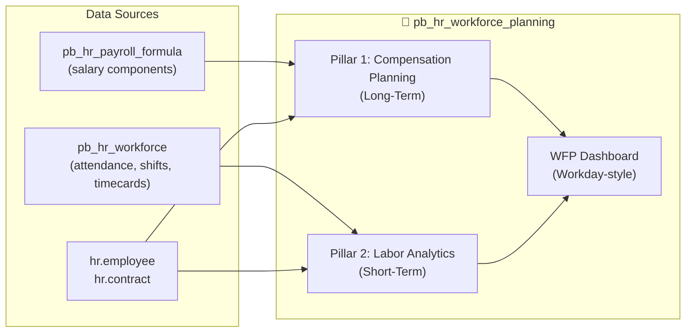

# Workforce Planning: Workday-Inspired Dual Forecasting Platform

## Background & Problem Statement

We have **two existing modules** that each cover one half of the workforce planning story:

| Module | Purpose | Current State |
|--------|---------|---------------|
| `pb_hr_workforce_planning` | **Long-term compensation forecasting** — salary increase scenarios, merit matrices, pay grades, cost projections | Functional backend, bland default Odoo list/form views, basic canvas-drawn dashboard |
| `pb_hr_workforce` | **Short-term operational workforce** — shift rosters, live attendance, timecards, overtime tracking | Rich JS dashboards (Chart.js), but no cost *forecasting* from labor data |

**Workday** unifies both into a single cohesive experience with stunning visualizations. The user wants us to:

1. **Add short-term labor cost forecasting** to `pb_hr_workforce_planning` (or bridge it with `pb_hr_workforce` data)
2. **Dramatically overhaul the UI** of all screens to be Workday-caliber: glassmorphic cards, dark-mode dashboards, heatmaps, bento grids, animated KPI counters

> [!IMPORTANT]  
> The goal is a **single unified WFP dashboard** where a user can toggle between "Compensation Planning" (long-term) and "Labor Analytics & Forecasting" (short-term). Think Workday's unified command center.

---

## Proposed Architecture: Two Pillars, One Module



We will **keep `pb_hr_workforce_planning` as the single module** and add `pb_hr_workforce` as a dependency to pull short-term labor data.

---

## User Review Required

> [!WARNING]
> **Dual Module Dependency**: This plan adds `pb_hr_workforce` as a dependency of `pb_hr_workforce_planning`. This means `pb_hr_workforce` must be installed for WFP to work. Is this OK, or should short-term labor analytics be optional (soft dependency with `try/except`)?

> [!IMPORTANT]
> **UI Theme**: The plan proposes a **dark-mode glassmorphic** theme for the unified dashboard, while keeping standard Odoo light forms for record editing. Should the dashboard be dark-mode by default, or should we support both light/dark?

> [!IMPORTANT]
> **Phase Scope**: This is a large overhaul. I propose splitting into two deployable phases:
> - **Phase A**: Dashboard UI overhaul + Long-term improvements (1 deployment)  
> - **Phase B**: Short-term labor analytics integration (2nd deployment)  
> Should I build both together or deploy Phase A first?

---

## Proposed Changes

### Component 1: Unified WFP Dashboard (Workday Command Center)

Replace the basic canvas-drawn dashboard with a premium, Workday-inspired OWL component.

**Design Concept** (Workday-inspired):
```
┌────────────────────────────────────────────────────────────┐
│  🏢 Workforce Planning                    [Scenario ▼]  🔒│
│  ┌─────────────────┐  ┌─────────────────┐                  │
│  │ COMPENSATION    │  │ LABOR           │  ← Tab switcher  │
│  │ PLANNING        │  │ ANALYTICS       │                  │
│  └─────────────────┘  └─────────────────┘                  │
├────────────────────────────────────────────────────────────┤
│  ┌──────┐ ┌──────┐ ┌──────┐ ┌──────┐ ┌──────┐ ┌──────┐  │
│  │ 127  │ │ 2.4M │ │ 2.6M │ │ 4.8% │ │ -30K │ │ 91%  │  │
│  │Heads │ │Curr. │ │Fcst. │ │Incr. │ │Var.  │ │Util. │  │
│  └──────┘ └──────┘ └──────┘ └──────┘ └──────┘ └──────┘  │
│  ← Glassmorphic KPI cards with animated counters           │
├────────────────────────────────────────────────────────────┤
│  ┌────────────────────────┐  ┌────────────────────┐       │
│  │ Monthly Cost Projection│  │ Dept Heatmap       │       │
│  │ ████▓▓░░ 12-month area │  │ ■■■■ cost heatmap  │       │
│  └────────────────────────┘  └────────────────────┘       │
│  ┌────────────────────────┐  ┌────────────────────┐       │
│  │ Compa-Ratio Scatter    │  │ Scenario Comparison │       │
│  │ ○ ○ ○ ○ performance ×  │  │ ▓▓ vs ▓▓ side-by   │       │
│  │       compa-ratio      │  │   side bars         │       │
│  └────────────────────────┘  └────────────────────┘       │
│  ← Bento grid layout with Chart.js / canvas charts        │
├────────────────────────────────────────────────────────────┤
│  Employee Detail Table (searchable, sortable, expandable)  │
│  [Search...] [Filter ▼] [Group By ▼] [Export]             │
│  Name | Dept | Grade | Curr Salary | Forecast | Δ | %     │
│  ├─ click row → side panel with component breakdown       │
└────────────────────────────────────────────────────────────┘
```

#### [MODIFY] [workforce_planning_dashboard.js](file:///Users/adity/Documents/GitHub/gitlocal/pb_hr_workforce_planning/static/src/js/workforce_planning_dashboard.js)
- Complete rewrite with Chart.js integration (instead of raw canvas)
- Two-tab architecture: **Compensation Planning** | **Labor Analytics**
- Animated KPI counters with delta indicators (▲/▼)
- Bento grid chart layout with 6 chart panels
- Employee detail table with expandable rows and side-panel drill-down
- Scenario comparison drawer (select 2 scenarios → side-by-side overlay)
- Global filters: Department, Job, Time Period
- Dark-mode glassmorphic theme

#### [MODIFY] [workforce_planning_templates.xml](file:///Users/adity/Documents/GitHub/gitlocal/pb_hr_workforce_planning/static/src/xml/workforce_planning_templates.xml)
- Complete template rewrite for the new dashboard layout
- Tab navigation component
- Glassmorphic KPI card templates
- Chart container templates with loading shimmer
- Employee table with expandable sections
- Side panel template for component breakdown drill-down

#### [MODIFY] [workforce_planning.css](file:///Users/adity/Documents/GitHub/gitlocal/pb_hr_workforce_planning/static/src/css/workforce_planning.css)
- Complete CSS rewrite with Workday-inspired design system:
  - CSS custom properties for theming (dark/light toggle)
  - Glassmorphic card styles: `backdrop-filter: blur(20px)`, semi-transparent backgrounds
  - Gradient accent colors matching each pillar
  - Animated counter keyframes
  - Loading shimmer skeleton screens
  - Responsive bento grid (`CSS Grid` with named areas)
  - Smooth transitions and micro-animations on hover
  - Custom scrollbar styling
  - Print-friendly overrides

---

### Component 2: Long-Term Compensation Improvements

Enhance existing scenario/forecast features with Workday-inspired visuals.

#### [MODIFY] [planning_scenario.py](file:///Users/adity/Documents/GitHub/gitlocal/pb_hr_workforce_planning/models/planning_scenario.py)
- Add `get_dashboard_data` improvements:
  - Compa-ratio distribution data (for scatter plot)
  - Department-level heatmap data (cost increase intensity)
  - Component-level breakdown (which salary components drive the most cost)
  - Scenario comparison API: accepts two scenario IDs → returns delta data
- Add `get_compensation_benchmarks` method for compa-ratio calculations

#### [NEW] [scenario_analytics.py](file:///Users/adity/Documents/GitHub/gitlocal/pb_hr_workforce_planning/models/scenario_analytics.py)
- New model `wfp.scenario.analytics` — analytics engine for dashboard data
- Caches computed analytics per scenario (avoids expensive re-computation)
- Methods:
  - `compute_compa_ratio_distribution()` — scatter plot data
  - `compute_dept_cost_heatmap()` — heatmap intensity matrix
  - `compute_component_waterfall()` — which components drive cost changes
  - `compute_scenario_comparison(scenario_a, scenario_b)` — delta analysis

---

### Component 3: Short-Term Labor Analytics (NEW — The Workday Differentiator)

This is the **new** capability the user requested — bridging `pb_hr_workforce` attendance/timesheet data into cost forecasting.

#### [NEW] [labor_analytics.py](file:///Users/adity/Documents/GitHub/gitlocal/pb_hr_workforce_planning/models/labor_analytics.py)
- New model `wfp.labor.analytics` — transient model for labor analytics dashboard
- Pulls data from `hr.attendance`, `hr.overtime.config`, `hr.shift.planning`
- Methods:
  - `get_labor_dashboard_data(date_from, date_to, department_id)`:
    - **KPIs**: Total hours worked, FTE count, utilization rate, overtime %, labor cost %, cost per hour
    - **Scheduled vs. Actual** comparison data per week/day
    - **Overtime trend** by department over 12 weeks
    - **Employee utilization heatmap** — matrix of employees × days, colored by hours worked
    - **Cost projection** — extrapolate current labor run-rate into 3/6/12 month forecast
  - `get_scheduled_vs_actual(week_start, department_id)`:
    - Day-by-day comparison: scheduled hours from `hr.shift.planning` vs actual from `hr.attendance`
    - Variance calculation with RAG (Red/Amber/Green) indicators
  - `get_overtime_cost_analysis(date_from, date_to)`:
    - OT hours × configured multiplier × hourly rate = OT cost
    - Breakdown by OT type (weekday, weekend, holiday, night)
    - "What if we reduced OT by X%?" simulation
  - `get_utilization_heatmap(date_from, date_to, department_id)`:
    - Employee × Day matrix with hours worked as cell value
    - Color scale: <6h=red, 6-8h=green, 8-10h=amber, >10h=red (burnout)
  - `get_labor_cost_forecast(months_ahead)`:
    - Based on trailing 3-month average labor patterns
    - Projects: regular hours cost + expected OT cost + leave impact
    - Monthly breakdown for forecast period

---

### Component 4: Dashboard Backend API Consolidation

#### [MODIFY] [planning_scenario.py](file:///Users/adity/Documents/GitHub/gitlocal/pb_hr_workforce_planning/models/planning_scenario.py)
- Refactor `get_dashboard_data` to serve both pillars
- Add `get_unified_dashboard_data()`:
  - Returns both compensation planning and labor analytics data in a single call
  - Structure: `{ pillar: 'compensation'|'labor', kpis: {...}, charts: {...}, table: [...] }`

---

### Component 5: Enhanced List/Form Views (Bye-bye Bland)

The current list and form views use default Odoo styling. We'll add custom CSS to make them feel premium.

#### [NEW] [wfp_views_enhanced.css](file:///Users/adity/Documents/GitHub/gitlocal/pb_hr_workforce_planning/static/src/css/wfp_views_enhanced.css)
- Custom styling for standard Odoo list/form views when inside WFP context:
  - Gradient stat buttons in form headers
  - Card-style notebook tabs with icons
  - Enhanced kanban cards with gradient borders and hover lift
  - Custom status bar with step indicators
  - Enhanced stat info cards with micro-animations
  - Better table row alternating colors and hover effects
  - Form header gradient banner
- All styles scoped to WFP models via CSS class prefixes

#### [MODIFY] [planning_scenario_views.xml](file:///Users/adity/Documents/GitHub/gitlocal/pb_hr_workforce_planning/views/planning_scenario_views.xml)
- Add CSS class `wfp-scenario-form` to the form view root
- Replace default kanban `card` template with premium card design:
  - Gradient top border by state
  - Mini donut chart showing forecast % in kanban card
  - Trend indicator arrow on headcount

#### [MODIFY] [employee_forecast_views.xml](file:///Users/adity/Documents/GitHub/gitlocal/pb_hr_workforce_planning/views/employee_forecast_views.xml)
- Enhanced list view with conditional row coloring
- Add `wfp-forecast-list` CSS class

#### [MODIFY] [compensation_cycle_views.xml](file:///Users/adity/Documents/GitHub/gitlocal/pb_hr_workforce_planning/views/compensation_cycle_views.xml)
- Add `wfp-cycle-kanban` CSS class for enhanced kanban cards

---

### Component 6: Module Configuration Updates

#### [MODIFY] [__manifest__.py](file:///Users/adity/Documents/GitHub/gitlocal/pb_hr_workforce_planning/__manifest__.py)
- Add `pb_hr_workforce` to `depends` list
- Add new CSS/JS/XML assets
- Bump version to `19.0.2.0.0`

---

## Feature Matrix: Current vs. Proposed (Workday Benchmark)

| Feature | Workday | Current WFP | Proposed |
|---------|---------|-------------|----------|
| **Long-Term: Salary Scenario Modeling** | ✅ | ✅ | ✅ Enhanced |
| **Long-Term: Merit Matrix** | ✅ | ✅ | ✅ |
| **Long-Term: Pay Grades & Compa-Ratio** | ✅ | ✅ (basic) | ✅ With scatter plot |
| **Long-Term: Scenario Comparison** | ✅ Side-by-side | ❌ | ✅ Overlay chart |
| **Long-Term: Component Waterfall** | ✅ | ❌ | ✅ What drives cost |
| **Long-Term: Department Heatmap** | ✅ | ❌ | ✅ Cost intensity |
| **Short-Term: Scheduled vs. Actual Hours** | ✅ | ❌ (in pb_hr_workforce but no cost analysis) | ✅ |
| **Short-Term: Labor Cost Forecasting** | ✅ | ❌ | ✅ 3/6/12 month |
| **Short-Term: Overtime Cost Analysis** | ✅ | ❌ (hours only, no cost) | ✅ With simulation |
| **Short-Term: Utilization Heatmap** | ✅ | ❌ | ✅ Employee × Day |
| **Short-Term: FTE / Cost per Hour** | ✅ | ❌ | ✅ |
| **UI: Glassmorphic Dashboard** | ✅ (modern) | ❌ Canvas only | ✅ |
| **UI: Dark Mode** | ✅ | ❌ | ✅ Optional |
| **UI: Animated KPI Counters** | ✅ | ❌ | ✅ |
| **UI: Bento Grid Layout** | ✅ | ❌ | ✅ |
| **UI: Loading Skeletons** | ✅ | ❌ | ✅ |
| **UI: Enhanced Kanban/Forms** | ✅ | ❌ Default Odoo | ✅ |

---

## Resolved Design Decisions

> [!NOTE]
> 1. **Soft dependency on `pb_hr_workforce`** — `pb_hr_workforce` is NOT a hard dependency. The Labor Analytics tab will simply be hidden when the attendance module isn't installed. Use `try/except` imports and runtime module detection.

> [!NOTE]
> 2. **Dark mode on Dashboard only** — The glassmorphic dark-mode theme applies ONLY to the WFP Dashboard (client action). Standard Odoo forms/lists keep the default Odoo light theme.

> [!NOTE]
> 3. **Hourly rate derived from contract** — `hr.contract.wage / (standard_hours_per_month)`. Standard hours come from `resource_calendar_id.hours_per_week * 52 / 12`.

> [!NOTE]
> 4. **Phase A first** — Deploy UI overhaul + long-term compensation improvements first. Phase B (short-term labor analytics) will be a follow-up deployment.

---

## Verification Plan

### Automated Tests
- Upgrade module on Payobook19 server with `--stop-after-init`
- Verify zero `ERROR`/`CRITICAL` in server logs
- Verify all 19+ DB tables remain intact

### Browser Verification
- Navigate to WFP Dashboard → verify glassmorphic KPI cards render
- Switch between Compensation Planning and Labor Analytics tabs
- Test scenario selection → verify charts render with data
- Test responsive layout at 768px and 480px breakpoints
- Verify kanban cards show enhanced styling
- Test employee table sorting, filtering, and row expansion
- Test scenario comparison overlay

### Manual Verification
- User reviews the new dashboard visual design
- User validates labor analytics data against known attendance records
- User tests export functionality from enhanced dashboard
