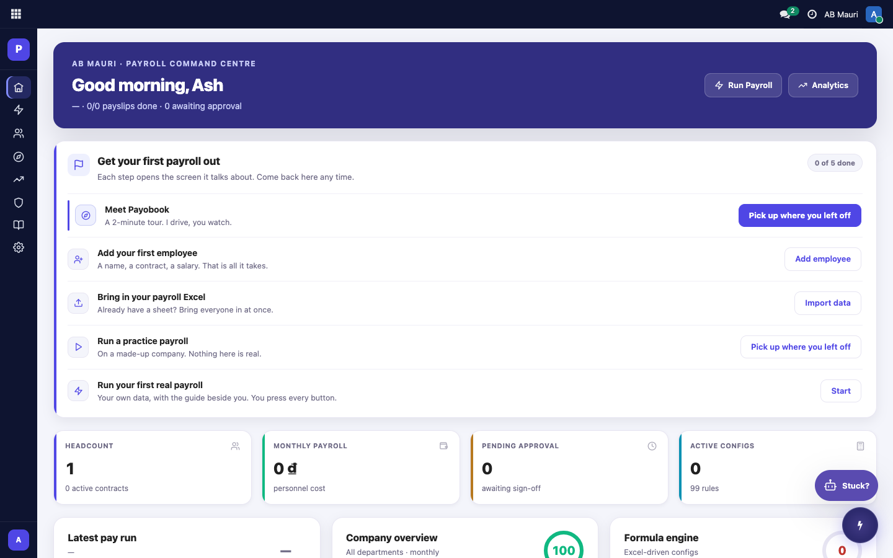
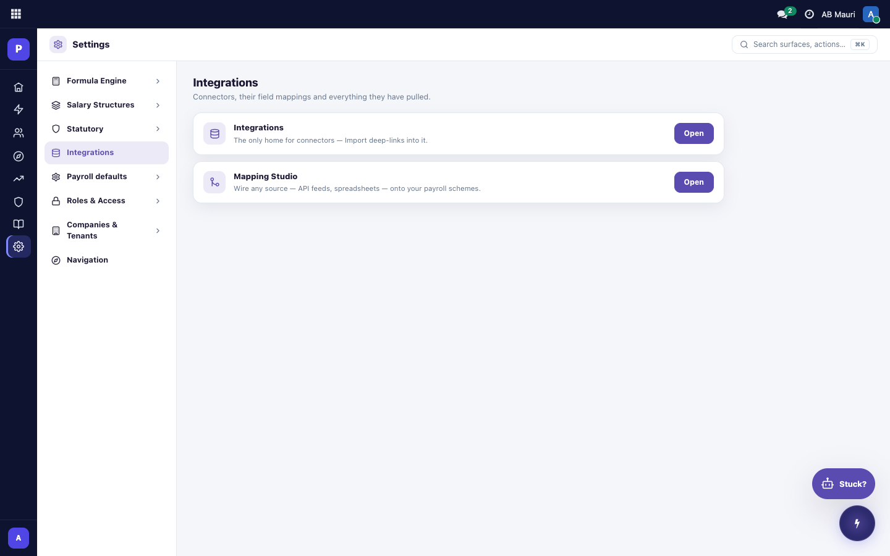
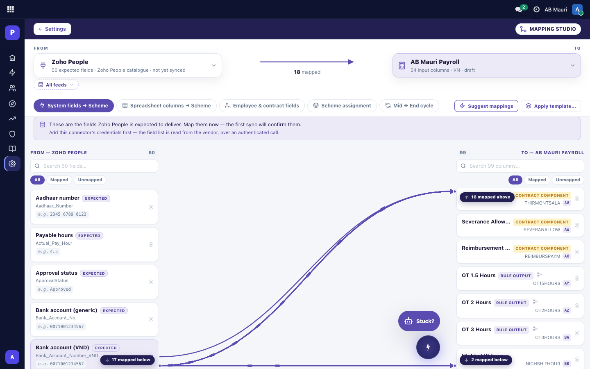
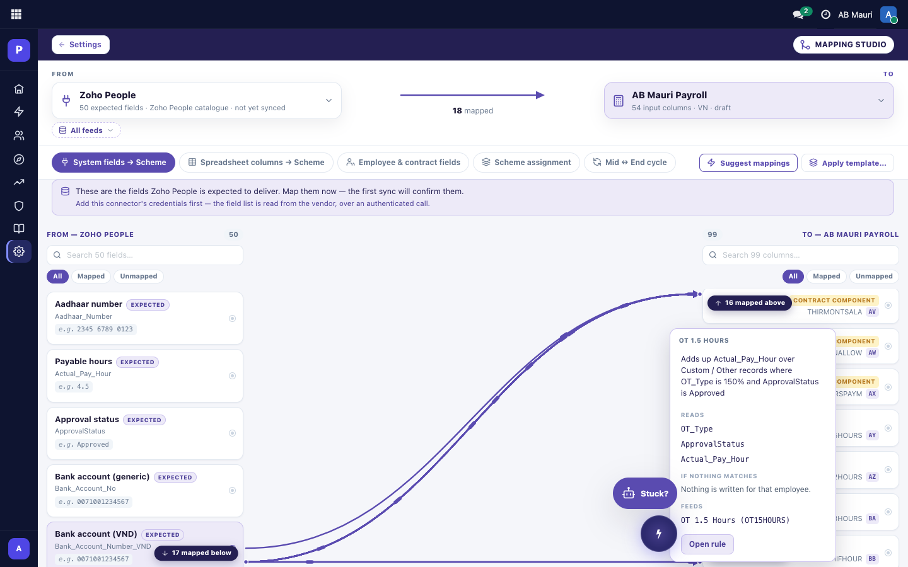
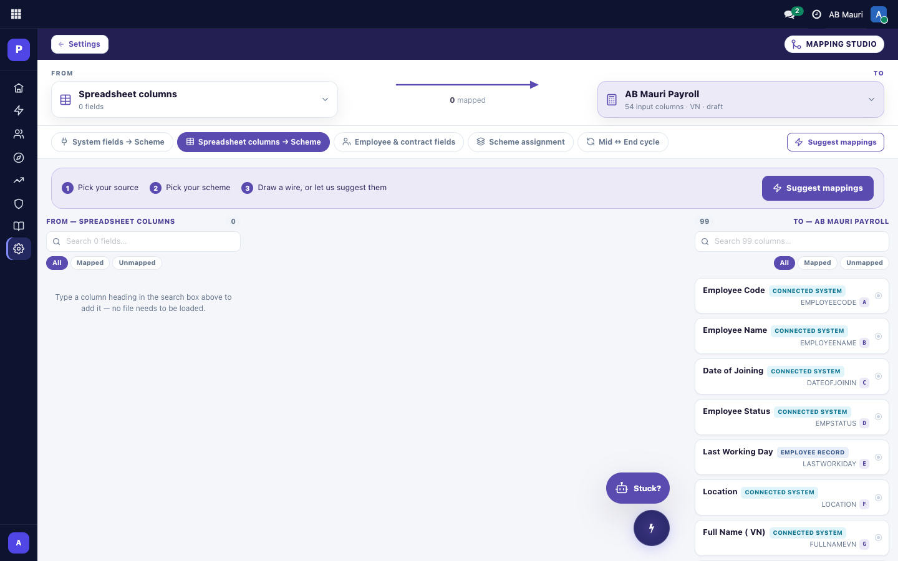
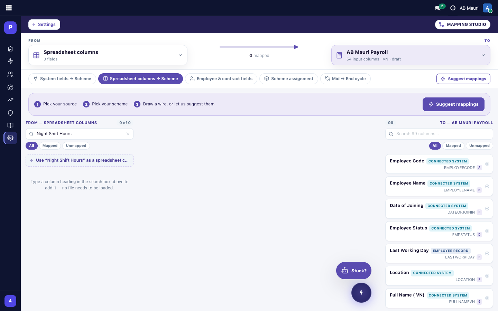
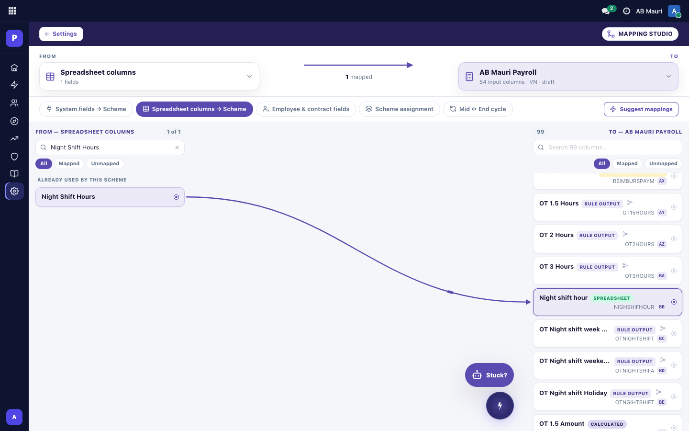
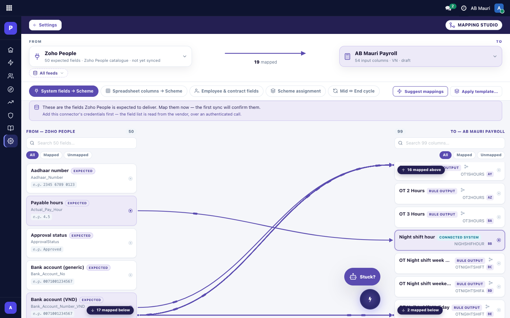

# Where every number comes from — and how to say where you want it to come from

A short guided tour of the Mapping Studio, using your own AB Mauri data. Every screenshot below was
taken on your live AB Mauri site, on the "AB Mauri Payroll" scheme, exactly as it stands today.

Nothing in this guide changes a payslip. Drawing a connection tells the next payroll run where to look;
it does not go back and rewrite anything that has already been paid.

---

## 1. Getting there

**Settings → Integrations → Mapping Studio → Open.** Three clicks from the home screen.

The gear at the bottom of the left-hand rail is Settings. Inside it, **Integrations** lists two things:
the connectors themselves, and the **Mapping Studio** — the board where you say what feeds what.

---

## 2. Reading the board

The header is one sentence, and both halves of it are pickers you can change:

> **FROM** Zoho People · 50 expected fields — **18 mapped** → **TO** AB Mauri Payroll · 54 input columns

The five buttons underneath choose **what kind of source** you are mapping from. The two that matter
most:

- **System fields → Scheme** — the fields a connected HR system delivers.
- **Spreadsheet columns → Scheme** — the columns of an uploaded file.

They are two doors onto **one** decision. Each component has exactly one source, and whichever board
you set it from, every screen then shows the same answer.

### The chip on each component

Every component on the right-hand side carries at most **one** small chip saying where its value comes
from. There are eight of them and they never mean anything else:

| Chip | What it means |
|---|---|
| **Spreadsheet** | A column of an uploaded file. You chose which one. |
| **Connected system** | A field a connected HR system sends. |
| **Rule output** | A number Payobook works out itself, before payroll sees it — overtime totals, dependant counts. It has a **lineage** button beside it. |
| **Contract component** | The amount stored on the employee's own contract. |
| **Employee record** | A field read straight off the employee or contract record. |
| **Calculated** | This scheme's own formula produces it. Nothing feeds it, and nothing can. |
| **Fixed value** | The same number for everybody — a rate, a cap, a percentage. |
| *(no chip)* | Nothing has been chosen yet. It will be matched by name if a column happens to line up. |

**Calculated** and **Fixed value** cannot be connected to anything, and the board will say so if you
try. That is not a restriction — those columns are produced by the scheme rather than imported into
it, so there is nothing to point them at.

A component with **no chip** is the opposite case: nothing has been chosen for it yet, and it is
waiting for you. Those are the ones to connect.

---

## 3. Seeing how a number is worked out

Find a component with a **RULE OUTPUT** chip — for example **OT 1.5 Hours** — and click the small
glyph of three linked dots just to the right of the chip.

Four parts, and one button:

- **The sentence at the top** — what the rule does, in words.
  *"Adds up Actual_Pay_Hour over Custom / Other records where OT_Type is 150% and ApprovalStatus is
  Approved."*
- **READS** — every field the rule looks at to produce its answer. If one of these stops arriving from
  the source system, this is the list that tells you what breaks.
- **IF NOTHING MATCHES** — what the rule produces for an employee it finds nothing for. Here:
  *"Nothing is written for that employee."* Some rules write a zero instead; this line always says
  which.
- **FEEDS** — which of your pay components actually receive the answer. *OT 1.5 Hours (OT15HOURS).*
  If this is empty, the rule is running and nobody is using the result.
- **Open rule** — opens the rule itself, where the steps can be edited.

Your eight worked-out fields are `OTHRS150`, `OTHRS200`, `OTHRS210`, `OTHRS270`, `OTHRS300`,
`OTHRS390`, `DEPCOUNT` and `WORKEDHRS`. Each one has a lineage button on the component it feeds, and
you can read it without switching connectors, without syncing, and without leaving the board.

---

## 4. Mapping a component from a spreadsheet

Click **Spreadsheet columns → Scheme**.

Your AB Mauri site has no uploaded file yet, so the left-hand column starts empty — and it tells you
what to do about it rather than stopping there. **You do not need to upload anything to set this up.**

Type the heading exactly as it appears in your workbook. An offer appears at the top of the column:

Click **Use "Night Shift Hours" as a spreadsheet column**, then click that card, then click the
component it should feed. One click each way.

The component now carries a green **SPREADSHEET** chip, and hovering it says
*"Already fed by Spreadsheet 'Night Shift Hours'."* The column has moved into a lane called
**Already used by this scheme**, so it is still there next time you open the board — with or without a
file loaded.

A column letter works too, if that is how you think about your workbook. Type `H` and connect it the
same way. A heading is safer: it survives someone inserting a column.

---

## 5. Mapping a component from a connected system

Click **System fields → Scheme**. The left-hand column is now the fields Zoho People is expected to
deliver. Click the field, then click the component. Identical gesture, different source.

The chip on the component turns to **CONNECTED SYSTEM**, and the count in the header goes up by one.

---

## 6. Switching a component from one source to the other

Just draw the new connection. There is no need to undo the old one, and no need to re-import anything.

The moment you do, a message names both sides so nothing changes behind your back:

> **"NIGHSHIFHOUR" now reads Connected system "Actual_Pay_Hour" instead of Spreadsheet "Night Shift
> Hours".**

To stop a component reading from anywhere at all, remove the connection using the bin on the
connecting line. The chip disappears and the component goes back to being matched by name.

---

## 7. What happens when a run uses both at once

You can feed one payroll run from a file **and** a connected system in the same run.

- The source you chose for a component **wins**. That is the whole point of choosing.
- If the source you chose sends nothing for a particular employee, the other side is used instead —
  and the run records that it fell back, so you can see it afterwards rather than wondering.
- If **both** sides send a value, yours is used and the other is recorded as *"also arrived — not
  used"*, with its number. Nothing is silently thrown away.

---

## 8. A short glossary

- **Component** — one column of your payroll scheme. AB Mauri Payroll has 99 of them, 54 of which take
  a value from outside.
- **Connector** — a connected HR system. You have two: *Zoho People* and *Zoho People (ABM)*. The FROM
  picker at the top left switches between them, and each has its own set of fields and its own
  worked-out rules.
- **Feed** — one stream of records from a connector: employees, leave, overtime.
- **Rule** — a step that works something out from what a connector sends, before payroll starts. The
  overtime totals are rules.
- **Scheme** — the payroll configuration itself. The TO picker switches between them.

---

*If a chip ever says something you do not expect, hover it. Every chip carries the full sentence,
including which run it is describing.*
